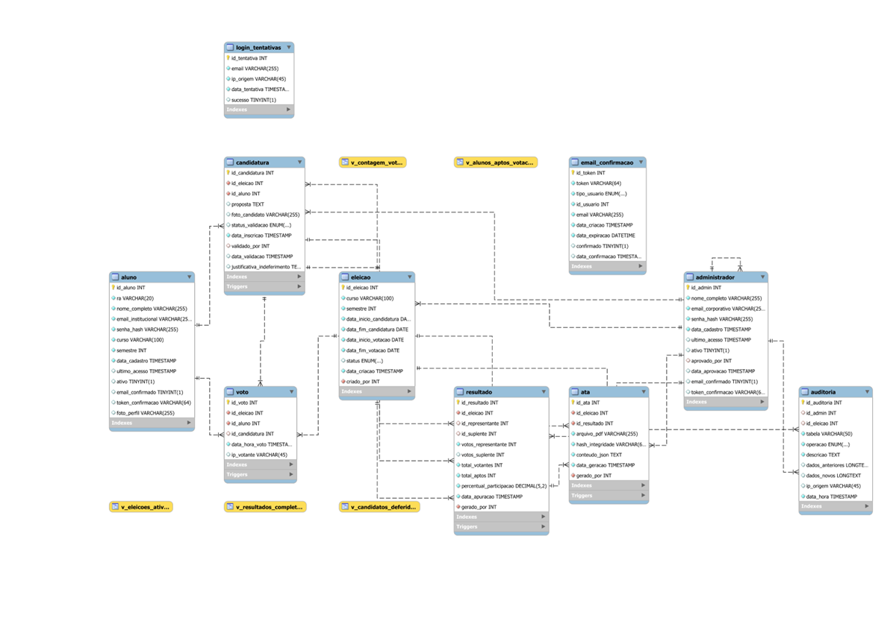

# Modelagem de Banco de Dados - SIV

## Sistema Integrado de Votação

## 1. DIAGRAMA ENTIDADE-RELACIONAMENTO

---

## 2. ESTRUTURA DO BANCO DE DADOS

### Tabelas Principais

O banco de dados é composto por 8 tabelas principais que gerenciam todo o ciclo de vida do processo eleitoral:

#### **ALUNO**
Armazena informações dos alunos cadastrados no sistema, incluindo dados pessoais, credenciais de acesso e informações acadêmicas (curso e semestre).

#### **ADMINISTRADOR**
Gerencia os usuários administradores do sistema, responsáveis pela criação de eleições, validação de candidaturas e finalização de processos eleitorais.

#### **ELEICAO**
Centraliza as informações de cada eleição, incluindo prazos para candidatura e votação, curso e semestre, e status atual do processo.

#### **CANDIDATURA**
Registra as inscrições de candidatos nas eleições, suas propostas, status de validação (pendente, deferido, indeferido) e justificativas administrativas.

#### **VOTO**
Armazena os votos registrados, garantindo anonimato do voto através da separação entre votante e escolha, mantendo apenas registros de auditoria necessários.

#### **RESULTADO**
Consolida os resultados finais de cada eleição, incluindo representante eleito, suplente, total de votos e percentual de participação.

#### **ATA**
Armazena as atas oficiais das eleições em formato PDF com hash de integridade (SHA-256) e dados estruturados em JSON para preservação histórica.

#### **AUDITORIA**
Registra todas as ações administrativas realizadas no sistema, mantendo histórico completo e imutável para rastreabilidade e conformidade.

---

## 3. RELACIONAMENTOS E CARDINALIDADES

### Relacionamentos Principais

-   **ELEICAO 1 ←→ N CANDIDATURA** - Uma eleição possui várias candidaturas
-   **ELEICAO 1 ←→ 1 RESULTADO** - Uma eleição gera um único resultado
-   **ELEICAO 1 ←→ 1 ATA** - Uma eleição gera uma única ata
-   **ELEICAO 1 ←→ N VOTO** - Uma eleição recebe vários votos
-   **ELEICAO 1 ←→ N AUDITORIA** - Uma eleição pode ter várias entradas de auditoria

### Relacionamentos de Participação

-   **ALUNO 1 ←→ N CANDIDATURA** - Um aluno pode candidatar-se em várias eleições
-   **ALUNO 1 ←→ N VOTO** - Um aluno pode votar em várias eleições (uma por turma)
-   **CANDIDATURA 1 ←→ N VOTO** - Uma candidatura pode receber vários votos
-   **CANDIDATURA 1 ←→ 1 RESULTADO** - Candidaturas podem ser representante ou suplente
-   **RESULTADO 1 ←→ 1 ATA** - Cada resultado gera uma ata

### Relacionamentos Administrativos

-   **ADMINISTRADOR 1 ←→ N ELEICAO** - Administrador cria eleições
-   **ADMINISTRADOR 1 ←→ N CANDIDATURA** - Administrador valida candidaturas
-   **ADMINISTRADOR 1 ←→ N RESULTADO** - Administrador finaliza eleições
-   **ADMINISTRADOR 1 ←→ N ATA** - Administrador gera atas
-   **ADMINISTRADOR 1 ←→ N AUDITORIA** - Administrador realiza ações auditadas

---

## 4. CONSTRAINTS E REGRAS DE NEGÓCIO

### Constraints de Unicidade

1. **Voto Único por Eleição**
   - `UNIQUE(id_eleicao, id_aluno)` na tabela VOTO
   - Garante que cada aluno vote apenas uma vez por eleição

2. **Candidatura Única por Eleição**
   - `UNIQUE(id_eleicao, id_aluno)` na tabela CANDIDATURA
   - Impede que aluno se candidate múltiplas vezes na mesma eleição

3. **Resultado Único por Eleição**
   - `UNIQUE(id_eleicao)` na tabela RESULTADO
   - Garante uma única apuração oficial por eleição

4. **Ata Única por Eleição**
   - `UNIQUE(id_eleicao)` na tabela ATA
   - Assegura um único documento oficial por eleição

5. **Eleição Única por Período**
   - `UNIQUE(curso, semestre, data_inicio_candidatura)` na tabela ELEICAO
   - Evita sobreposição de eleições para mesma turma

### Constraints de Integridade Referencial

- **CASCADE em CANDIDATURA, VOTO, RESULTADO, ATA**: Exclusão de eleição remove todos os dados relacionados
- **SET NULL em AUDITORIA**: Preserva logs mesmo após exclusão de entidades relacionadas
- **RESTRICT em ADMINISTRADOR**: Impede exclusão de admin que criou eleições

### Validações por Triggers

6. **Validação de Turma na Candidatura**
   - Trigger `trg_valida_candidatura_turma`
   - Verifica se aluno pertence à turma da eleição antes de aceitar candidatura

7. **Validação de Turma no Voto**
   - Trigger `trg_valida_voto_turma`
   - Garante que aluno só vote em eleição da sua turma

8. **Validação de Candidatura Deferida**
   - Trigger `trg_valida_voto_candidatura_deferida`
   - Permite votos apenas em candidaturas com status "deferido"

9. **Validação de Status da Eleição**
   - Trigger `trg_valida_voto_turma`
   - Aceita votos apenas quando eleição está com status "votacao_aberta"

10. **Validação de Ordem Cronológica**
    - Constraints `chk_datas_candidatura` e `chk_datas_votacao`
    - Verifica ordem lógica: início < fim e candidatura < votação

11. **Imutabilidade de Resultado**
    - Trigger `trg_impede_alteracao_resultado`
    - Impede qualquer modificação após geração do resultado oficial

12. **Imutabilidade de Ata**
    - Trigger `trg_impede_alteracao_ata`
    - Preserva integridade documental impedindo alterações

13. **Imutabilidade de Auditoria**
    - Triggers `trg_auditoria_impedir_update` e `trg_auditoria_impedir_delete`
    - Garante que logs de auditoria sejam permanentes e inalteráveis

### Validações de Domínio

- **Semestre válido**: `CHECK(semestre BETWEEN 1 AND 6)`
- **Percentual válido**: `CHECK(percentual_participacao BETWEEN 0 AND 100)`
- **Status de eleição**: `ENUM('candidatura_aberta', 'votacao_aberta', 'aguardando_finalizacao', 'encerrada')`
- **Status de candidatura**: `ENUM('pendente', 'deferido', 'indeferido')`
- **Tipo de operação**: `ENUM('INSERT', 'UPDATE', 'DELETE', 'LOGIN', 'LOGOUT')`

---

## 5. NORMALIZAÇÃO

### Forma Normal Alcançada: 3FN (Terceira Forma Normal)

O banco de dados foi projetado para alcançar a Terceira Forma Normal (3FN), garantindo:

#### **1FN - Primeira Forma Normal**
- ✅ Todas as tabelas possuem chave primária única
- ✅ Todos os atributos são atômicos (não há grupos repetitivos)
- ✅ Não há colunas multivaloradas

#### **2FN - Segunda Forma Normal**
- ✅ Cumpre 1FN
- ✅ Não há dependências parciais
- ✅ Todos os atributos não-chave dependem completamente da chave primária

#### **3FN - Terceira Forma Normal**
- ✅ Cumpre 2FN
- ✅ Não há dependências transitivas
- ✅ Atributos não-chave dependem apenas da chave primária
- ✅ Não há atributos derivados desnecessários

### Desnormalizações Intencionais

Para otimização de performance e requisitos de auditoria, foram mantidas as seguintes desnormalizações controladas:

1. **Campo `percentual_participacao` em RESULTADO**
   - Valor calculado e armazenado
   - Justificativa: Evita recálculos em consultas frequentes e preserva valor histórico exato

2. **Campo `conteudo_json` em ATA**
   - Snapshot completo dos dados da eleição
   - Justificativa: Preservação histórica e integridade documental independente de alterações posteriores

3. **Campos de auditoria (`dados_anteriores`, `dados_novos`)**
   - Armazenamento redundante de informações
   - Justificativa: Rastreabilidade completa e conformidade regulatória

---

## 6. REQUISITOS ATENDIDOS

### Mapeamento de Requisitos Funcionais

| Requisito | Implementação no Banco de Dados |
|-----------|--------------------------------|
| **RF01-04: Gestão de Usuários** | Tabelas ALUNO e ADMINISTRADOR com autenticação segura |
| **RF05-07: Gestão de Candidaturas** | Tabela CANDIDATURA + Triggers de validação de turma |
| **RF08-11: Gestão de Votação** | Tabela VOTO + Triggers + Constraints de unicidade |
| **RF12-13: Apuração de Resultados** | Tabela RESULTADO + Stored Procedure `sp_finalizar_eleicao` |
| **RF14: Geração de Ata** | Tabela ATA com hash de integridade e imutabilidade |
| **RF15: Relatórios e Estatísticas** | Views otimizadas + Campos calculados em RESULTADO |
| **RF16: Lista de Alunos Aptos** | View `v_alunos_aptos_votacao` |
| **RF17: Validação de E-mail** | Constraints UNIQUE em email_institucional e email_corporativo |
| **RF18: Auditoria Completa** | Tabela AUDITORIA com triggers automáticos e imutabilidade |
| **RF19: Integridade de Dados** | Sistema completo de constraints, triggers e validações |

### Requisitos Não-Funcionais Atendidos

- **Segurança**: Hash de senhas, validações de domínio, auditoria imutável
- **Integridade**: Constraints rigorosas, triggers de validação, foreign keys
- **Rastreabilidade**: Sistema completo de auditoria com registro de IP e timestamps
- **Performance**: Índices estratégicos, views otimizadas, stored procedures
- **Confiabilidade**: Imutabilidade de resultados e atas, backup via hash SHA-256

---

## 7. OBSERVAÇÕES TÉCNICAS

### SGBD Target
- **MySQL 8.0+** ou **MariaDB 10.5+**
- Charset: `utf8mb4` (suporte completo a Unicode)
- Collation: `utf8mb4_unicode_ci` (ordenação case-insensitive)

### Stored Procedures Implementadas
- `sp_finalizar_eleicao`: Finaliza eleição e gera resultado
- `sp_atualizar_status_eleicoes`: Atualiza status automaticamente baseado em datas
- `sp_auto_finalizar_eleicoes`: Processa eleições aguardando finalização

### Views Disponíveis
- `v_candidatos_deferidos`: Lista candidatos aprovados por eleição
- `v_contagem_votos`: Contabilização de votos em tempo real
- `v_eleicoes_ativas`: Eleições em andamento com estatísticas
- `v_resultados_completos`: Resultados finais com informações detalhadas
- `v_alunos_aptos_votacao`: Alunos elegíveis para votar e status de voto

---

**Para o script SQL completo de criação do banco de dados, consulte o arquivo [siv_db.sql](../database/siv_db.sql).**

---

_Modelagem criada em: 30/10/2025_
_Última atualização: 12/12/2025_
_SGBD Target: MySQL 8.0+ / MariaDB 10.5+_
